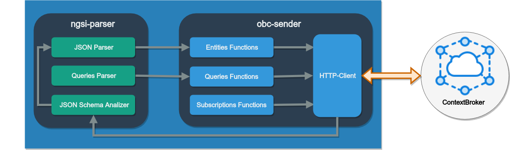

# smartsdk-ngsi-js-library

JavaScript 用の NGSI ライブラリは、JSON エンティティを NGSI データモデルに変換する目的で、FIWARE Orion Context Broker によってマニピュレートまたはオペレートできるソフトウェア・ツールです。このライブラリは、NodeJS 実行環境とともに、RESTFul Web サービスまたはバックエンドを介してアプリケーションに実装できます。このライブラリは、React Native や Native Script などの Android または iOS ネイティブ・アプリケーションを開発するための言語として、 JavaScript を使用するフレームワークを使用したモバイル・アプリケーションの開発にも使用できます。

NGSI ライブラリは Orion Context Broker のクライアントであり、JSON オブジェクトの解析機能を実装してデータモデルとの一致を判断し、JSON オブジェクトを NGSI v2 エンティティに変換する機能も実装しています。

NGSI ライブラリは、2つの npm モジュールで構成されています :

### NGSI-parser モジュール

NGSI-parser モジュールは、非構造化 JSON オブジェクトの構文を解析して、それらを FIWARE NGSIv2 コンテキスト・エンティティに変換します。

[ngsi-parser](https://github.com/cenidetiot/ngsi-parser)

### OCB-sender モジュール

OCB-sender モジュールは、Orion Context Broker のクライアントです。このクライアントは、NGSI コンテキスト・エンティティの更新を Orion Context Broker に送信する目的で、FIWARE NGSIv2 コンテキスト・エンティティのコンテキスト情報をマニピュレートします。このようにしてオペレートします。

[ocb-sender](https://github.com/cenidetiot/ocb-sender)

## NGSI ライブラリの仕組み

NGSI ライブラリのアーキテクチャは、npm: ngsi-parser と OCB-sender という2つのモジュールで構成されています。これらのモジュールは、1つの JavaScript プロジェクトでのみインポートできます。図は、ライブラリのアーキテクチャの ngsi-parser と OCB-sender モジュールを示しています。

### ngsi-parser モジュール

ngsi-parser モジュールは、非構造化 JSON オブジェクトまたは属性の構文を解析して変換し、NGSI エンティティ・コンテキストで、それを変換するという目的を持っています。さらに、このモジュールは、エンティティが FIWARE データモデルの標準仕様を満たすかどうかを検証する機能を提供します。ライブラリは、オリジナルの JSON 構造が対応する FIWARE データモデルと一致するかどうかを検証します。これらのデータモデルは、SmartSDK プロジェクトのアカウント Github のリポジトリ "dataModels" に置くことができます。

ngsi-parser には、JSON オブジェクトの解析を実行するための3つの基本要素が含まれています。a) JSON パーサ には、非構造化 JSON オブジェクトの解析と変換に必要な機能が含まれています。b) クエリ・パーサは、Orion Context Broker から特定のデータを取得するためのコンテキスト・クエリを生成するために JSON オブジェクトを解釈する責任がある要素です。最後に、c) データ JSON スキーマ・アナライザは、JSON オブジェクトがデータモデルを満たすかどうかを判断する責任があります。また、JSON スキーマとデータモデルの一致のエラーリストを生成します。

### ocb-sender モジュール

ocb-sender モジュールは、情報を Orion Context Broker の1つのインスタンスに送信するために、NGSI コンテキスト・エンティティおよび/または FIWARE データモデルのコンテキスト情報を操作することを主な目的としています。 ocb-senser モジュールは、4つの要素で構成されています。最初の3つの要素は、Orion Context Broker クライアントの機能をカプセル化するために使用されます。a) エンティティ関数は、Orion Context Broker のエンティティを操作する関数を実装します。b) クエリ関数は、Orion Context Broker へのパーソナライズされたクエリの機能を考慮します。c) サブスクリプション関数は、Orion Context Broker のサブスクリプションを操作する関数を実装します。d) HTTP クライアントは Orion Context Broker の接続を担当し、このコンポーネントは ngsi-parser がリポジトリの JSON スキーマを取得するためにも使用されます。

## インストールの前提条件

NGSI JS LIbrary の npm モジュールを両方使用するには、次の要件を満たす必要があります。

### Node.js と npm

Node.js のインストールは、実行可能なインストーラまたはソースコードをダウンロードすることによって行われます。これは、インストールされているオペレーティング・システムに直接依存します。Node.js の公式ページには、ダウンロード・ファイルとそのインストール手順を見つけることができます。公式のダウンロード・リンクは次のとおりです：
[https://nodejs.org/en/download/](https://nodejs.org/en/download/)

Node.js の現在のバージョンは 8.10.0 です。このバージョンには、バージョン5.6.0に npm が含まれています。

NGSI Javascript library の両方のモジュールをインストールするには、以下のバージョンを事前にインストールする必要があります

- node.js >= 8.x.x (バージョン 8.10.0 以上)
- npm >= 5.x.x (バージョン 5.0.0 以上)

Node および npm の現在のバージョンを確認するには、コンソールで次のコマンドを実行します :

- node -v
- npm -v
