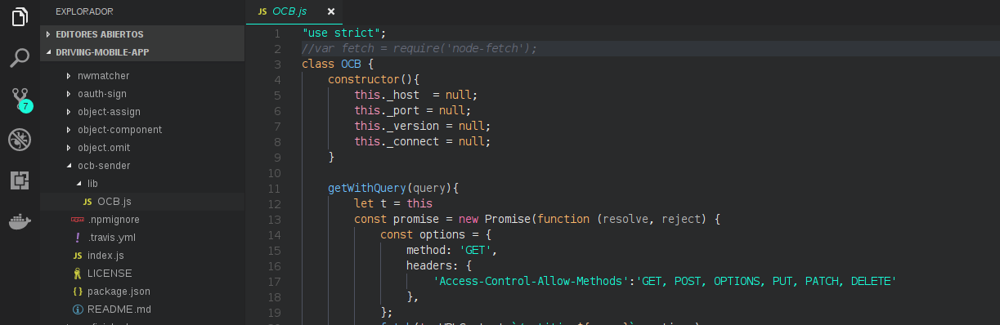

# モバイル・アプリケーションの開発における OCB の使用

モバイル・アプリの開発に ocb-sender npm モジュールを使用すると、モジュールのコードが少し変更されます。プロジェクト内で ocb-sender npm モジュールをダウンロードしたら、node_modules フォルダにリダイレクトしてから、このフォルダ内で ocb-sender パッケージのフォルダを検索します。このフォルダを見つけたら、lib フォルダの中でこのフォルダを探します。

ocb-sender パッケージの lib フォルダに OCB.js というファイルがあります。ファイルを開き、次の行にコメントします :

```js
    var fetch = require('node-fetch');
```

## 例



将来、ocb-sender npm パッケージのこの問題は、このモジュールをインストールした運用システムを検出して改善することができます。このようにして、ユーザは OCB.js ファイルでこれらの変更を行う必要はありません。


