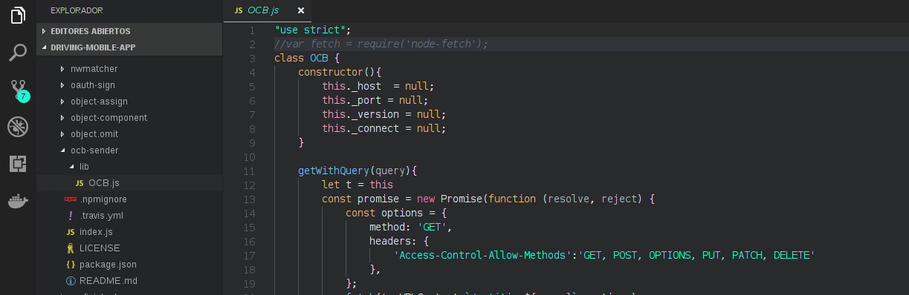

# Implementation of OCB-sender module in Mobile Apps

The implementation of ocb-sender module in the development of mobile apps involve a little change in the code of the module. The first step is download the npm module inside in your mobile app project. Afterwards, you must search the node_modules folder within the project folder. The node_modules folder contains the folder of the ocb-sender package. When you have located the folder of ocb-sender package, search inside of this one the lib folder. In the lib folder of ocb-sender package is the file OCB.js, open this file and comment the following line:
```js
    var fetch = require('node-fetch');
```
## Example



