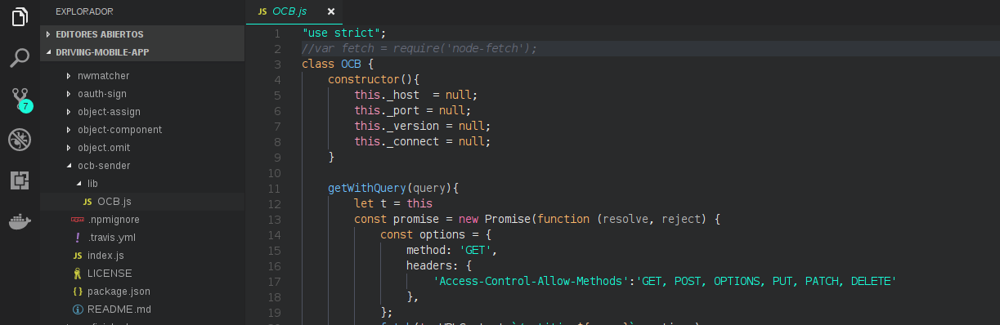

# OCB-sender usage in Development of Mobile Apps

The usage  of ocb-sender npm module in the development of mobile apps involve a little change in the code of the module. Once you have download the ocb-sender npm module inside in your project, you should to redirect to the node_modules folder an then, inside of this folder, search the folder of the ocb-sender package. When you have located this folder, search inside of this one the lib folder. 

In the lib folder of ocb-sender package is located the file OCB.js, open the file and comment the following line:

```js
    var fetch = require('node-fetch');
```

## Example



In the Future, this issue in ocb-sender npm package it could be improved, detecting the operative system where was installed this module. And in this way, the user would not have to do these changes in the OCB.js file.


