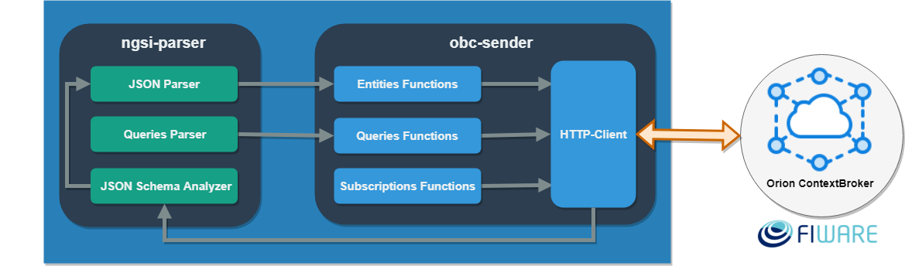

# Introduction

Welcome to the quick start guide of NGSI JavaScript Library! In this brief chapter, you will find general information to help you understand the way that the library is conformed and how it works.
The NGSI Library manipulates the context entities according to the FIWARE-NGSI v2 API. The specification that is intended to manage the entire lifecycle of context information, including updates, queries, registrations, and subscriptions. 
The NGSI Library is composed of two npm modules; i.e node packages that can be found in the [official site of npm](https://www.npmjs.com/).

### NGSI-parser module

The NGSI-parser module analyzes the syntax of non-structured JSON objects to transform them into FIWARE-NGSIv2 entities, through treatment of the context entity or data model given by a context producer and following the guidelines of the official specification of the NGSIv2. In addition, this module provide functionalities to verify the structure of the entities to check if this fulfills with the specification of an official data model of FIWARE.

- [ngsi-parser repository](https://github.com/cenidetiot/ngsi-parser)

### OCB-sender module
OCB-sender module is an Orion ContextBroker's client. This client manipulates the context information of FIWARE-NGSIv2 context entities, with the aim of send the updates of NGSI context entities to the Orion Context Broker and, in this way make operations with them.

- [ocb-sender repository](https://github.com/cenidetiot/ocb-sender)

## How it works the NGSI library

The architecture of the NGSI library is composed by two modules npm: ngsi-parser and ocb-sender. These modules can be imported in only one JavaScript project and work altogether with both modules. Figure shows the modules ngsi-parser and ocb-sender of the architecture of the library.

 
### ngsi-parser module

The ngsi-parser module has the objective of analyzing and converting the syntax of a non-structured JSON object or attribute to transform it in a NGSI entity context. Additionally, this module provides the functionality to verify if the entity fulfills with the standard specification of a FIWARE data model. The library verifies if the original JSON structure match with the corresponding FIWARE data model. These data models can be located in the repository “dataModels” of the SmartSDK GitHub account.
The ngsi-parser contains three basic elements to perform the analysis of the JSON objects: 

- **a) a JSON Parser**, that includes the function needed for the analysis and transformation of a non-structured JSON object to one that fulfill with the NGSI standard.
- **b) a Queries Parser**, that is the responsible element to interpret JSON objects to produce context queries to obtain specific data from the Orion Context Broker.
- **c) a Data JSON Schema Analyzer**, that is the responsible to determine if a JSON object fulfills or not fulfills with a specific data model, in case that the JSON entity does not complies with the official specification of the data model specified, the analyzer generates the list of errors in the match between the official JSON schema of the data model and the structured of the JSON entity.

### ocb-sender module

The main objective of ocb-sender module is manipulate the context information of NGSI context entities and/or FIWARE data models, in order to send this information to an instance of the Orion Context Broker. The ocb-sender module is composed by four elements, first three elements are the client functionalities of the Orion Context Broker and the last one is the HTTP - Client encapsulated as communication channel for the connection with the Orion Context Broker. This four components are the following: 

- **a) an Entities Functions block**, that implements the functions to manipulate the entities of the Orion Context Broker. 
- **b) a Queries Functions block**, that considers the functions for personalized queries to the Orion Context Broker.
- **c) a Subscriptions Functions block**, that implement the functions to manipulate the subscriptions of the Orion Context Broker.
- **d) the HTTP-Client is the responsible**, for the connection of the Orion Context Broker, this component is also used for the ngsi-parser to obtain the JSON schemas  from a repository.

## More Information

This is a small introduction of the NGSI Library, if you learn more about the library consult to following sections:

- Refer to the [Installation & Administration Manual](adminManual.md) to learn more about installing the modules of the library and getting them running.
- Refer to the [User & Programmers Manual](usersManual.md) to learn more about the functionalities that offers each one of the library modules and how make operations in conjunction with both modules.
- If exists doubts about how the context entities or data models are treated, please visit the reference of [FIWARE- NGSI v2 specification](http://fiware.github.io/context.Orion/api/v2/stable/).
